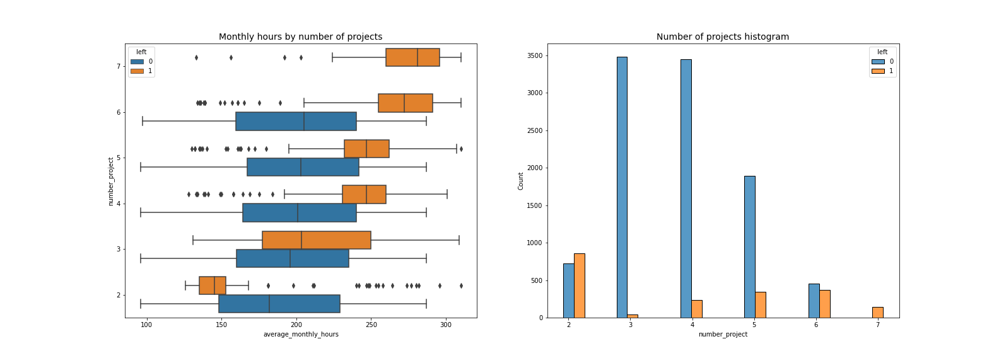
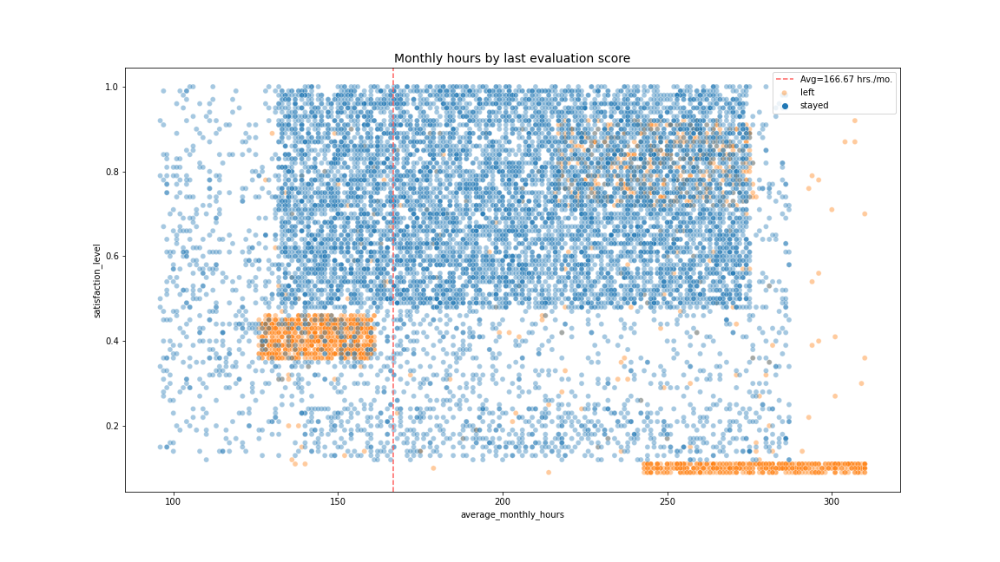
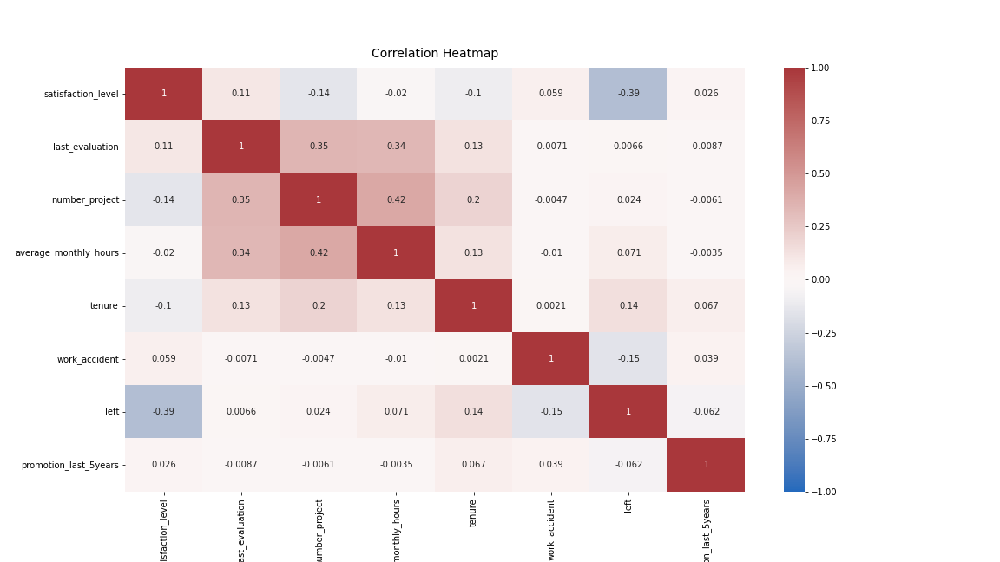
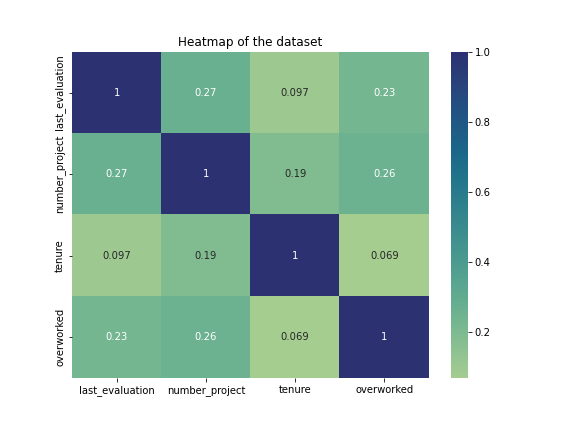
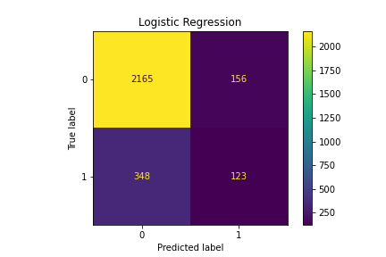
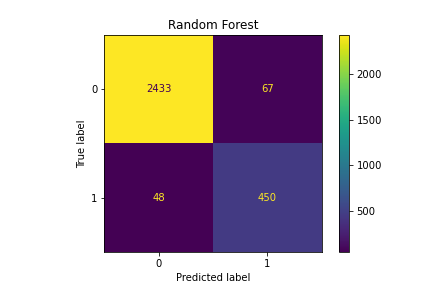
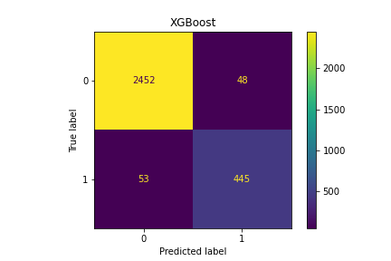
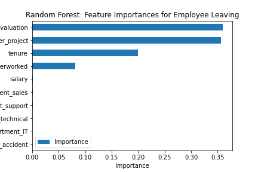
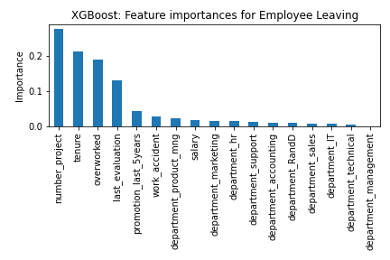

# Saliford Motors Employee Retention Prediction
Developing a predictive model to predict whether an employee will leave using exploratory data analysis and machine learning.

Note: This project is a part of *Google Advanced Data Analytics Professional Certificate* program.

# Project Overview
In this project, we develop a classification model to predict employee retention. More specifically, the goal is to build a machine learning model that can be used to determine  whether or not an employee will leave the company. We use a dataset from Kaggle and organize the raw dataset for further analysis. Thorugh extensive exploratory data analysis (EDA), we explored, analyzed, cleaned, and structured data to learn the relationship among variables in the data and to gain insights into employee management of the company. Finally, we constructed classification models (regression and tree-based) to predict employee retention. 

The order of notebooks to follow:
- Salifort Motors project lab.ipynb

# Business Understanding 
Salifort Motors, a fictional energy vehicle manufacturer, want to increase employee retention. Based on a recent employee survey, they want to analyze the collected data and design a model that predicts whether an employee will leave the company. If we can predict employees likely to quit, it might be possible to identify factors that contribute to their leaving. Because it is time-consuming and expensive to find, interview, and hire new employees, increasing employee retention will be beneficial to the company.

# Data Understanding 
The HR department at Salifort Motors collected the data that contains 10 columns and 14,999 rows, each row representing a different employee's data. In the dataset, there's no missing/null entries, however there are 2008 duplicated rows. With most of the variables are continuous variables across 10 columns, it is highly unlikely that almost 20% of the data is duplicate and legitimate at the same time. Therefore, we removed these rows before futher processing. The data is not perfectly balanced with approximately 83%-17% split in favor of *not leaving*, nevertheless it is not too imbalanced.

During our EDA, the correlation heatmap confirms that the number of projects, monthly hours, and evaluation scores all have some positive correlation with each other, and whether an employee leaves is negatively correlated with their satisfaction level.

It's likely that the company won't have satisfaction levels reported for all of its employees or the satisfaction level reported do not resemble the true satisfaction. It's also possible that the `average_monthly_hours` column is a source of some data leakage. If employees have already decided upon quitting, or have already been identified by management as people to be fired, they may be working fewer hours. We could proceed by dropping satisfaction_level and creating a new feature through feature engineering process that roughly captures whether an employee is overworked. This new binary feature could be named `overworked`, define as working more than approximately the average number of monthly hours that a person would be working for per month, which is 175 hours.

 

 

# Modeling and Evaluation 

Since, our goal is to predict whether an employee leaves the company, this task involves binary classification. The target variabel `left` being categorical, we built a Binomial Logistic Regression model, and Tree-based Machine Learning model such as  Decision Tree, Random Forest, and XGBoost.

The logistic regression model achieved precision of 79%, recall of 82%, f1-score of 80% (all weighted averages), and accuracy of 82%, on the test dataset. However, if it's most important to predict employees who leave, then the scores are significantly lower.

After feature engineering and introducing a new feature named `overworked`, the Random Forest model achieved AUC of 93.8%, precision of 87.0%, recall of 90.3%, f1-score of 88.7%, and accuracy of 96%, on the test set, whereas Decision Tree model achieved 93.3% AUC, 78% precision, 91.7% recall, 84.5% f1-score, and 94.4% accuracy score. However, investigating the confusion matrices, we found that Decision Tree produces 41 and 126 false negatives and false positives, respectively, compared to Random Forest's 48 and 67 false negatives and false positives, respectively. Therefore, we can conclude that Random Forest model slightly outperformed Decision Tree model.
These models predicts more false positives than false negatives, which means that some employees may be identified as at risk of quitting or getting fired, when that's actually not the case. Nevertheless, these are still strong models.

Even though, XGBoost achieves slightly better precision (90%), f1-score (89.8%), and accuracy (96.6%) than Random Forest, it's recall (89.3%) and AUC (93.7%) score slightly fell short. Also, it causes more false negative predictions (53) compared to false positive predictions (48).

From the results, we can conclude that both Random Forest and XGBoost models perform well in predicting employee retention.  

   

 

# Conclusion

The developed predictive models performed exceptionally well on the test holdout data. Also from our EDA, it appears that employees are leaving the company as a result of poor management. Leaving is tied to longer working hours, many projects, and generally lower satisfaction levels. It can be ungratifying to work long hours and not receive promotions or good evaluation scores. There's a sizeable group of employees at this company who are probably burned out. 

To retain employees, the following recommendations could be presented to the stakeholders:
- Limit the number of projects employees can engage in.
- Provide incentives for employees working extended hours, or eliminate the requirement for extended work hours, and promote employees who have served the company for a considerable amount of time.
- Initiate company-wide and team-specific discussions to comprehend and address the overall and context-specific work culture within the company.
